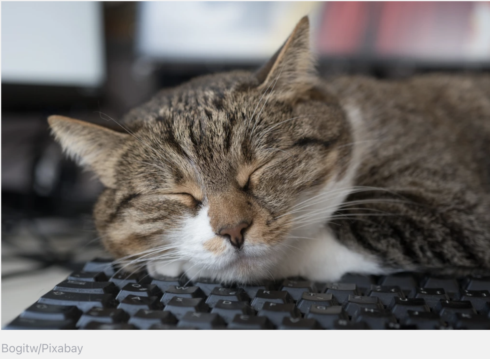

```{r setup, echo = FALSE}
knitr::opts_chunk$set(fig.width = 6, message = FALSE, warning = FALSE, comment = "", cache = F)
xaringanExtra::use_tile_view()
```


```{r, echo=FALSE}
# Helper packages - need dplyr and ggplot
library(conflicted)
suppressMessages(conflict_prefer("select", "dplyr"))
suppressMessages(conflict_prefer("filter", "dplyr"))
suppressPackageStartupMessages(library(tidyverse))
library(ggthemes)

suppressPackageStartupMessages(library(tidymodels))
tidymodels_prefer()
library(flipbookr)
library(knitr)
```


# Overview

## We will cover the following:


+ String manipulation.  

+ `str`_functions.    

+ Regular Expressions.  


---

# Prepare the following packages for this lecture:

```{r eval=FALSE}
install.packages("learnr")
library(learnr)
library(palmerpenguins)
library(tidyverse)

```

.pull-left[
.center[]
]

.pull-right[
.center[]
]

.center[]

---

# What are strings ?

Words or characters. 

.center[]

```{r include=TRUE, echo=TRUE, eval=TRUE}
string <- c( "It is just english", "inside a vector")
string
```

---
# Why should you care?

Manipulating strings usually is part of the Wrangling process 


.center[]


---
# `stringr` Package?

+ `stringr` version 1.4.0 has a total of 53 functions.  

--
+ 41 of them start with `str_`

```{r eval=FALSE}
stringr::str
```
.center[]

---
# We are not covering all...

.center[]

--

<mark>But we will cover the most often used functions</mark>
---

# The functions 

.center[]
```{r eval=FALSE}
str_legth() 
str_c()
str_sub()
str_split()
str_subset()
str_extract()
str_match()
str_replace()
str_replace_all()
str_to_lower()
str_to_upper()
str_to_title()
```

---
# Examples

--

<mark>**str_length()**</mark>. 
Counts the number of "code points", in a string
```{r}
names <- c("Gabriel", "Anny", "Catalina")
```

```{r}
str_length(names)
```

--
<mark>**str_c()**</mark>. 
Joins two or more vectors into a single character vector,
```{r}
sep_sentence <-   c("Hi everyone", "I want this to be", "only one sentence", "HELP!")
sep_sentence
one_sentence <-  str_c(sep_sentence, collapse = ", ")
one_sentence
```

---
# Examples

--
<mark>**str_sub**</mark>. 
Extract substrings from a character vector, from = start, to = end
```{r}
sense <- ("This makes no sense")
str_sub(sense, 1,10)
str_sub(sense, 15)

```
--
<mark>**str_subset**()</mark> Keep strings matching a pattern,
```{r}
more_sense <- c("This makes no sense", "although", "I am", "understanding")
str_subset(more_sense, "u")
str_subset(more_sense, "c")

```

---
# Examples

--
<mark>**str_split()**</mark>. 
Split up a string into pieces
```{r}
surnames <- c("Ferdus Tarana", "Rodriguez Christofer", "Salehe Said")
surnames
str_split(surnames, pattern = "," , simplify = TRUE)

```

--
<mark>**str_extract**()</mark> Extract matching patterns from a string
```{r}
project2 <- c("12L", "52M", "1B", "nonsense2", "12", "more 2 think")
str_extract(project2, "\\d")
str_extract(project2,  "\\d+")
```
---
# Examples

--
<mark>str_replace()</mark> Replace matched patterns in a string
```{r}
typos <- c("kansas", "kansas", "kansas", "kansas", 
           "k", "hansas", "k")

str_replace(typos, pattern =  "kansas", replacement = "k")

```


---
# Examples

--
<mark>str_to_lower()</mark>
```{r}
capital <- c("MY OBJECT", "ONLY HAS", "CAPITAL LETTERS", "UNTIL", "...")

lower_case <- str_to_lower(capital)
lower_case
```
--
<mark>str_to_upper()</mark>

```{r}
str_to_upper(lower_case)
```
--
<mark>str_to_title()</mark>

```{r}
str_to_title(capital)
```

---
class: segue

Regular Expressions

---
# Rexexps
.center[]


---
# For real...Regexp

Are a concise and flexible tool for describing patterns in strings.

Examples:
```{r}
fast_food <- c("hamburgers", "(hamburgers9", "1hot dog", "(fries12", "2sandwich", ".")
```
--
```{r}
str_extract(fast_food, "h")

```
--
```{r}
str_extract(fast_food, "^h")
```
--
```{r}
str_extract(fast_food, "h$")
```
--
```{r}
str_extract(fast_food, "\\d+")
```


---
# Types of Regular Expressions `r emo::ji("smile")``r emo::ji("sad") ` `r emo::ji("mad") `
There are **three** basic types of regular expressions:

--
1. Regular expressions that stand for individual symbols and determine frequencies

--
2. Regular expressions that stand for classes of symbols

--
3. Regular expressions that stand for structural properties

.center[]

---
# Escaping... `r emo::ji("rocket")`  

```{r}
fast_food
```

The last character in our string is `"."`  


How do you match a literal `"."` or `"("`?

--

```{r}
str_extract(fast_food, ".")
```
---

# Escaping... `r emo::ji("rocket")`  
--
```{r}
str_extract(fast_food, "\\.")


```
--
```{r}
str_extract(fast_food, "\\(")
```
--
```{r}
str_extract(fast_food, c("\\.|\\(" ))
```
--
You need to use an “escape” to tell the regular expression you want to match it exactly
not use its special behavior.

To create the regular expression `"\."` you need the string `"\\."`

---

## Regular expressions that stand for individual symbols and determine frequencies.

| RegEx Symbol/Sequence | Explanation                                           |
| --------------------- | ----------------------------------------------------- |
| \*                    | The preceding item will be matched zero or more times |
| +                     | The preceding item will be matched one or more times  |
|\.                     |The Wild card, takes the place of anything

---
## Regular expressions that stand for individual symbols and determine frequencies.
<mark>Examples</mark>
--
```{r}
str_extract(fast_food, "ham.+")

```
--
```{r}
str_extract(fast_food, ".+")

```
--
```{r}
str_replace(fast_food, "\\(", "")
```

---
## Regular expressions that stand for classes of symbols.
| RegEx Symbol/Sequence | Explanation                                                       |
| --------------------- | ----------------------------------------------------------------- |
| \[ab\]                | lower case a and b                                                |
| \[a-z\]               | all lower case characters from a to z                             |
| \[AB\]                | upper case a and b                                                |
| \[A-Z\]               | all upper case characters from A to Z                             |
| \[12\]                | digits 1 and 2                                                    |
| \[0-9\]               | digits: 0 1 2 3 4 5 6 7 8 9                                       |
| \[:digit:\]           | digits: 0 1 2 3 4 5 6 7 8 9                                       |
| \[:lower:\]           | lower case characters: a–z                                        |
| \[:upper:\]           | upper case characters: A–Z                                        |

---
## Regular expressions that stand for classes of symbols.
<mark>Examples</mark>
```{r}
str_extract(fast_food, "[ab].+")

```
--
```{r}
str_extract(fast_food, "[1-2].+")

```
--
```{r}
str_extract(fast_food, "[:digit:]")
```

---

## Regular expressions that stand for structural properties.

| RegEx Symbol/Sequence | Explanation                            |
| --------------------- | -------------------------------------- |
| \\\\w                 | Word characters: \[\[:alnum:\]\_\]     |
| \\\\W                 | No word characters: \[^\[:alnum:\]\_\] |
| \\\\s                 | Space characters: \[\[:blank:\]\]      |
| \\\\S                 | No space characters: \[^\[:blank:\]\]  |
| \\\\d                 | Digits: \[\[:digit:\]\]                |
| \\\\D                 | No digits: \[^\[:digit:\]\]            |
| ^                     | Beginning of a string                  |
| $                     | End of a string                        |

---

## Regular expressions that stand for structural properties.
<mark>Examples</mark>

```{r}
str_extract(fast_food, "\\d")
```
--
```{r}
str_extract(fast_food, "\\W")
```
--
```{r}
str_extract(fast_food, "g$")
```

---

## Finally, let's clean that horrible fast_food string

`r chunk_reveal("my_food")`

---

```{r my_food, include=FALSE, message=FALSE, warning=FALSE}
   tibble(fast_food) %>%
   rename(food = fast_food) %>%
   mutate(
     clean = str_remove_all(
       food, "[:digit:]")
    ) %>%
   mutate(
     clean = str_remove_all(
       clean, "\\(")
    ) %>%
   mutate(
     clean = str_replace(
       clean, "\\.", "Pizza")
     ) %>% 
   mutate(
     clean = str_to_sentence(clean)
     ) %>%
  select(Food = clean)
```

---
## Last valuable tip

Separate()
It is not a str function but it is mostly use to separate into columns or rows 
strings. 
It comes from the `tidyr` package (loaded with tidyverse)
Example: 
```{r echo=FALSE}
us_currency<- data.frame(
                CountryCurrency = c('Bolivar- Venezuela','Dollar- Australia','Peso- Colombia'),
                 ValuePer_1USd = c(33137.833, 1.478, 4534.00),
                 Opinion=c('OMG', 'Ok', 'J e s u s...')) 
us_currency
```
--
```{r}
us_currency %>% 
  separate(CountryCurrency, c("Currency", "Country"), sep = "-") 
 
```
---
## Let's remove that annoying space
`r chunk_reveal("space")`


---

```{r space, include=FALSE, message=FALSE, warning=FALSE}
 us_currency %>% 
  separate(CountryCurrency, 
           c("Currency", "Country"), 
           sep = "-"
  ) %>% 
  mutate(
    Country = str_trim(
      Country,
      side = "left")
  ) %>% 
  dplyr::filter(
    Country == "Colombia"
  )
```

---
## Let's go practice `r emo::ji("face")`

1. Download the .rmd file sent to your email 
2. install `learnr`
3. hit run 


---
## Useful resources

https://stringr.tidyverse.org/articles/regular-expressions.html
https://stringr.tidyverse.org/
https://ladal.edu.au/regex.html
https://nuitrcs.github.io/r-tidyverse/html/stringr.html
https://regexone.com/lesson/excluding_characters?

---
## [\\T^h*e \\ $E^n#d \\]
.center[]